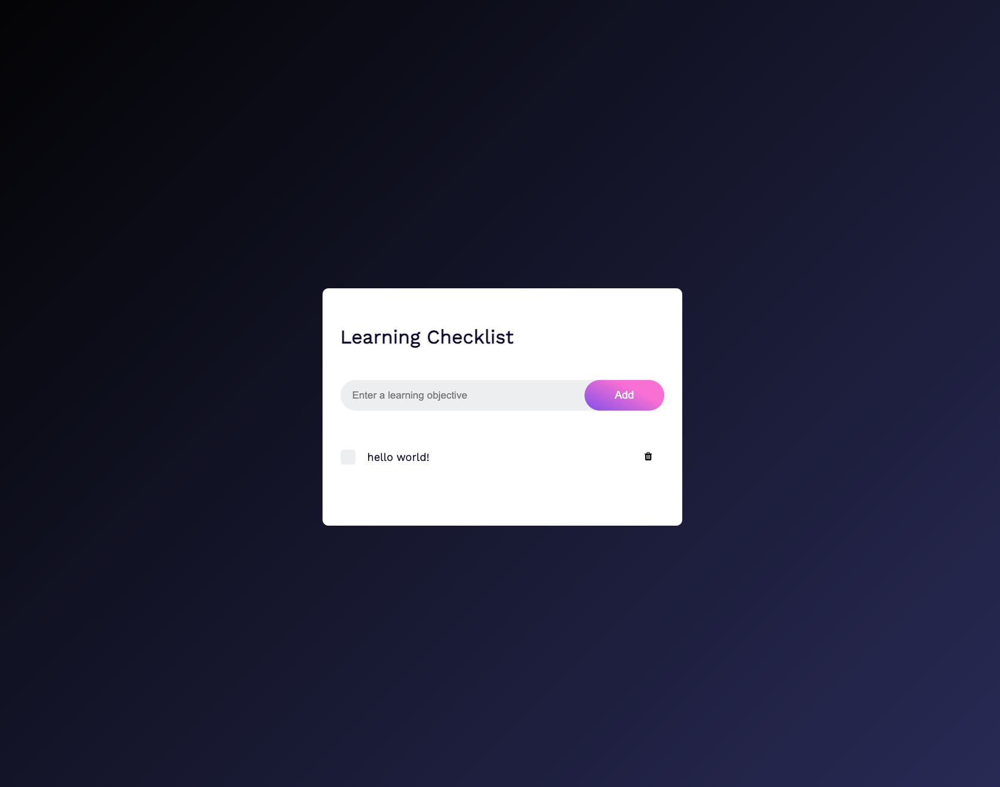

## Simple Checklist Built With Spin

This sample application presents users with a simple checklist rendered with Spin's static fileserver, and keeps track of the checklist's status using Spin's default Key Value store. The Spin application made of 3 components: 

* `static-fileserver` - Spin's static fileserver to generate the UI 
* `api` - an API to manage to the checlist items (via Spin's router)
* `kv-explorer` Spin's `key-value-explorer` to keep track of the checklist items and their status. 

To get started, please make sure you're using Spin v1.0 or later ([spin installation instructions](https://developer.fermyon.com/spin/v2/install) along with the necessary JS/TS dependencies shown below. 

```bash
spin plugins install js2wasm --yes
```

You can then run the application locally via the following command:

```bash
spin build --up
```

Then (optionally), if you would like to deploy to Fermyon Cloud, make sure to install the [`spin cloud` plugin](https://developer.fermyon.com/spin/v2/install#plugins) and [login](https://developer.fermyon.com/cloud/quickstart#log-in-to-the-fermyon-cloud) before running:

```bash
spin cloud deploy
```


